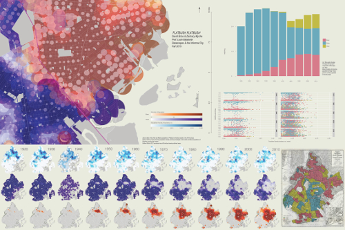

##A GIS study of race and Flatbush Avenue

David Brice | Zachary Wyche  

####Printout

#### [Video (3:35)](http://www.youtube.com/watch?feature=player_embedded&v=lAFkztJ-WwQE)

######Final Project from "Datascapes and the Informal City" with Professor Leah Meisterlin

_Flatbush Flatbush_ is a dynamic visualization of demographic change in the area along Flatbush Avenue south of Prospect Park, also called Flatbush, Brooklyn. 

Two trends emerge over time which are clear in the maps and data visualisations: a steadily increasing Black population and a steadily decreasing white population. Between 1920 and 2010 Brooklyn’s black population slowly approaches a border, or “wall” at Flatbush Avenue near Brooklyn College. Be it through formal or informal processes, Flatbush Avenue functions as a line of segregation, which remains incredibly rigid to this day. Census data from the first half of the 20th century show that Brooklyn’s black population was mostly confined to the area north of Prospect Park. This pattern of segregation was (re)affirmed by the Home Owners’ Loan Corporation, a corporation created as part of the New Deal to help homeowners finance and refinance their mortgages. The HOLC authored a series of ‘Residential Security Maps,’ meant to show areas in need of investment, but these maps were actually used to further entrench segregation and demarcate areas which would receive the least investment. These were, usually, areas with high Black populations. Redlining, as the practice came to be known, ensured segregation would continue for decades to come. And while it did, in the midst of suburbanization in the 1950s and 1960s, and White Flight in the 1970s and 1980s, many once predominantly white neighborhoods became predominantly black neighborhoods.

Flatbush Flatbush</em> follows these changes over time, using GIS- and R-based analysis of historical census data to show not only statistical change, but also, and more importantly, spatial change. The film and accompanying materials show both the full borough of Brooklyn as well a zoomed-in picture of the Flatbush neighborhood, which has remained a border between white and Black neighborhoods of Brooklyn for the past half-century. Census tract level-data from the US census was used to create these maps, but for the sake of visual clarity the tracts are represented as circles where color and size both correspond to the ratio of race to the total population. We felt it best to use circles, instead of tracts with discrete boundaries, in order to most clearly represent areas which are more racially integrated. Population density is calculated as the total population divided by the “ORIG_AREA” field in the NHGIS shapefile for all years except 1940 and 2010, where the shapefile area is used due to irregularities in the size and shape of the census tracts.

The film is meant to facilitate historical education on segregation in New York City and is intended for a general audience (albeit one with some familiarity with urban history and the history of race relations in the US).

Census Data: NHGIS-provided data tables and shapefiles from 1920 to 2010, rectified to 2008 shapefile versions.  
HOLC Map: ‘Digital HOLC Maps Archive.’ Urbanoasis.org. [http://www.urbanoasis.org/projects/holc-fha/digital-holc-maps]  
Mapping: QGIS.  
Plots: R with ggplot2  
Music: Erik Arc Elliott (of Flatbush Zombies) _Arcstrumentals Vol.  1_

